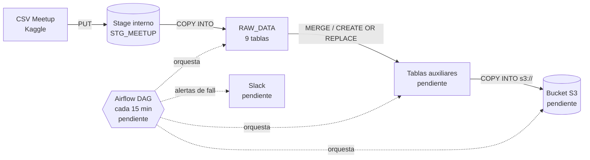

# Meetup Data Pipeline: Snowflake + Airflow + S3

Prueba técnica de Data Engineer. El proyecto carga el dataset **Meetup (Kaggle)** en **Snowflake**, lo transforma en tablas físicas auxiliares, automatiza el proceso con un DAG de **Apache Airflow** cada 15 minutos, notifica fallos por **Slack** y exporta las tablas procesadas a un bucket **S3**.

---

## Tabla de contenido

1. [Estado del proyecto](#estado-del-proyecto)
2. [Arquitectura](#arquitectura)
3. [Stack tecnológico](#stack-tecnológico)
4. [Estructura del repositorio](#estructura-del-repositorio)
5. [Dataset](#dataset)
6. [Requisitos previos](#requisitos-previos)
7. [Configuración del entorno](#configuración-del-entorno)
8. [Seguridad y manejo de credenciales](#seguridad-y-manejo-de-credenciales)
9. [Ejecución paso a paso](#ejecución-paso-a-paso)
10. [Decisiones de diseño](#decisiones-de-diseño)
11. [Calidad de datos: hallazgos](#calidad-de-datos-hallazgos)
12. [Validación](#validación)
13. [Problemas encontrados y soluciones](#problemas-encontrados-y-soluciones)
14. [Evidencias](#evidencias)
15. [Próximos pasos](#próximos-pasos)

---

## Estado del proyecto

| # | Requisito | Estado |
|---|-----------|--------|
| 1 | Cuenta gratuita de Snowflake | ✅ Completado |
| 2 | Carga del dataset Meetup en Snowflake | ✅ Completado (ver [hallazgos de calidad](#calidad-de-datos-hallazgos)) |
| 3 | Tablas físicas auxiliares | ⏳ Pendiente |
| 4 | DAG de Airflow cada 15 min (`MERGE`, `CREATE`, `REPLACE`) | ⏳ Pendiente |
| 5 | Alertas de Airflow hacia Slack | ⏳ Pendiente |
| 6 | Exportación de tablas procesadas a S3 | ⏳ Pendiente |
| 7 | Entrega de código, evidencias y repositorio | 🔄 En curso |

---

## Arquitectura



**Capas en Snowflake** (base de datos `RAPPI_MEETUP_DB`):

| Esquema | Propósito | Estado |
|---------|-----------|--------|
| `RAW_DATA` | Datos tal cual vienen del CSV, todas las columnas como `VARCHAR` | ✅ |
| `STAGING` | Datos limpios y con tipos correctos | ⏳ |
| `AUX` / `CORE` | Tablas auxiliares y agregadas, mantenidas con `MERGE` | ⏳ |

---

## Stack tecnológico

| Componente | Uso |
|------------|-----|
| Snowflake (trial, AWS) | Almacenamiento y transformación |
| Snowflake CLI (`snow`) | Ejecución de scripts SQL y conexión |
| Python 3.10 a 3.13 | Scripts auxiliares (CLI, generación de claves) |
| Apache Airflow | Orquestación (pendiente; se recomienda Python 3.11/3.12 o Docker) |
| Slack (webhook o app) | Alertas (pendiente) |
| AWS S3 | Destino de exportación (pendiente) |

---

## Estructura del repositorio

```
.
├── sql/
│   ├── 01_setup_stage.sql              # File format y stage interno
│   ├── 02_put_files.sql                # Subida de CSV al stage (PUT)
│   ├── 03_create_and_load_raw.sql      # Tablas RAW y COPY INTO
│   └── 04_fix_encoding_and_reload.sql  # Recarga con manejo de caracteres inválidos
├── gen_keys.py                         # Genera el par de claves RSA (la privada NO se versiona)
├── dags/                               # DAG de Airflow (pendiente)
├── docs/evidence/                      # Capturas y salidas de validación
├── data/                               # CSV originales (ignorado por Git)
├── .gitignore
└── README.md
```

---

## Dataset

Dataset **Meetup** de Kaggle: `<URL del dataset en Kaggle>`.

Los CSV se colocan en la carpeta `data/`, que **no se versiona** (GitHub rechaza archivos de más de 100 MB y `members.csv` pesa 1,2 GB).

| Archivo | Tamaño | Filas leídas | Tabla destino |
|---------|--------|--------------|---------------|
| `categories.csv` | < 0,1 MB | 33 | `RAW_DATA.CATEGORIES` |
| `cities.csv` | < 0,1 MB | 13 | `RAW_DATA.CITIES` |
| `events.csv` | 7,5 MB | 5.807 | `RAW_DATA.EVENTS` |
| `groups.csv` | 23,7 MB | 16.330 | `RAW_DATA.GROUPS` |
| `groups_topics.csv` | 1,6 MB | 31.212 | `RAW_DATA.GROUPS_TOPICS` |
| `members.csv` | 1.229,9 MB | 5.893.886 | `RAW_DATA.MEMBERS` |
| `members_topics.csv` | 152,4 MB | 3.195.245 | `RAW_DATA.MEMBERS_TOPICS` |
| `topics.csv` | 0,3 MB | 2.509 | `RAW_DATA.TOPICS` |
| `venues.csv` | 15,4 MB | 107.093 | `RAW_DATA.VENUES` |

---

## Requisitos previos

- Cuenta de Snowflake (el trial gratuito de 30 días es suficiente).
- Python 3.10 o superior.
- Git.
- Los CSV del dataset descargados en `data/`.
- Para las etapas siguientes: Airflow, un workspace de Slack y una cuenta de AWS con un bucket S3.

---

## Configuración del entorno

### 1. Entorno virtual e instalación

```powershell
python -m venv .venv
.\.venv\Scripts\Activate.ps1
python -m pip install --upgrade pip
python -m pip install snowflake-cli
```

### 2. Variables de entorno para Windows

Si Python se instaló desde la Microsoft Store, el CLI puede fallar al escribir su configuración (ver [problemas encontrados](#problemas-encontrados-y-soluciones)). Define estas variables en cada ventana de terminal:

```powershell
$env:SNOWFLAKE_HOME = "$HOME\.snowflake"
$env:PYTHONUTF8 = "1"
New-Item -ItemType Directory -Force $env:SNOWFLAKE_HOME | Out-Null
```

### 3. Par de claves RSA

La cuenta trial no tiene SSO, así que `externalbrowser` no funciona. Se usa autenticación por **key-pair**, que además es la que necesita Airflow.

```powershell
python gen_keys.py
```

El script guarda la clave privada en `~/.snowflake/keys/rsa_key.p8` (fuera del repositorio) e imprime la clave pública, que se registra en Snowflake en el siguiente paso.

### 4. Rol y usuario de servicio en Snowflake

Ejecutar en un worksheet de Snowsight con el rol `ACCOUNTADMIN` y **Run all** (Ctrl+Shift+Enter). Sustituir `<CLAVE_PUBLICA>` por la salida del script anterior:

```sql
USE ROLE ACCOUNTADMIN;

CREATE ROLE IF NOT EXISTS ETL_ROLE;
GRANT USAGE ON WAREHOUSE SNOWFLAKE_LEARNING_WH TO ROLE ETL_ROLE;
GRANT ALL ON DATABASE RAPPI_MEETUP_DB TO ROLE ETL_ROLE;
GRANT ALL ON ALL SCHEMAS IN DATABASE RAPPI_MEETUP_DB TO ROLE ETL_ROLE;
GRANT ALL ON ALL TABLES IN SCHEMA RAPPI_MEETUP_DB.RAW_DATA TO ROLE ETL_ROLE;
GRANT ALL ON FUTURE TABLES IN SCHEMA RAPPI_MEETUP_DB.RAW_DATA TO ROLE ETL_ROLE;

CREATE USER IF NOT EXISTS SVC_ETL
  TYPE = SERVICE
  DEFAULT_ROLE = ETL_ROLE
  DEFAULT_WAREHOUSE = SNOWFLAKE_LEARNING_WH
  RSA_PUBLIC_KEY = '<CLAVE_PUBLICA>';

GRANT ROLE ETL_ROLE TO USER SVC_ETL;
-- Permite que ACCOUNTADMIN vea y administre lo que cree ETL_ROLE
GRANT ROLE ETL_ROLE TO ROLE ACCOUNTADMIN;
```

### 5. Conexión del CLI

```powershell
snow connection add --connection-name etl_conn `
  --account <ORG>-<CUENTA> `
  --user SVC_ETL `
  --authenticator SNOWFLAKE_JWT `
  --private-key-file "$HOME\.snowflake\keys\rsa_key.p8" `
  --role ETL_ROLE `
  --warehouse SNOWFLAKE_LEARNING_WH `
  --database RAPPI_MEETUP_DB `
  --schema RAW_DATA `
  --no-interactive

snow connection test -c etl_conn
```

El identificador de cuenta se copia desde Snowsight (menú del perfil, *Account*, *Copy account identifier*). La prueba debe terminar con `Status: OK`.

---

## Seguridad y manejo de credenciales

- **Ninguna credencial se versiona.** `.gitignore` excluye `.venv/`, `data/`, `*.csv`, `*.p8`, `.env` y `__pycache__/`.
- **Autenticación por key-pair** con un usuario de tipo `SERVICE` (`SVC_ETL`), sin contraseña.
- **Mínimo privilegio:** el pipeline usa `ETL_ROLE`, con permisos solo sobre `RAPPI_MEETUP_DB` y el warehouse de trabajo, en lugar de `ACCOUNTADMIN`.
- La clave privada vive fuera del repositorio. En Airflow se inyectará como secreto (Connection o variable de entorno), nunca dentro del código del DAG.
- El warehouse tiene `AUTO_SUSPEND` corto para no consumir créditos del trial sin necesidad.

`.gitignore` recomendado:

```
.venv/
data/
*.csv
*.p8
.env
__pycache__/
```

---

## Ejecución paso a paso

Con la conexión `etl_conn` funcionando y los CSV en `data/`:

```powershell
# 1. File format y stage interno
snow sql -c etl_conn -f sql/01_setup_stage.sql

# 2. Subir los CSV al stage (PUT comprime a gzip automáticamente)
snow sql -c etl_conn -f sql/02_put_files.sql

# 3. Crear tablas RAW y cargar con COPY INTO
snow sql -c etl_conn -f sql/03_create_and_load_raw.sql

# 4. Recargar MEMBERS y TOPICS con manejo de caracteres inválidos
snow sql -c etl_conn -f sql/04_fix_encoding_and_reload.sql
```

> **No volver a ejecutar `01_setup_stage.sql` después del paso 2:** su `CREATE OR REPLACE STAGE` borraría los archivos ya subidos.

Antes de ejecutar `02_put_files.sql`, ajustar las rutas absolutas de los `PUT` a la ubicación local del proyecto (con barras normales `/`, por ejemplo `file://C:/Users/.../data/members.csv`).

---

## Decisiones de diseño

| Decisión | Motivo |
|----------|--------|
| Carga por código (`PUT` + `COPY INTO`) en lugar de la interfaz web | La interfaz web limita los archivos a 250 MB, y `members.csv` pesa 1,2 GB |
| No dividir los archivos en bloques | `PUT` sube en paralelo y comprime: `members.csv` quedó en unos 165 MB comprimidos |
| Capa RAW con todas las columnas como `VARCHAR` | Evita errores de carga por fechas o números mal formados; los tipos se aplican en staging |
| Autenticación por key-pair | `externalbrowser` no funciona en la cuenta trial y Airflow no tiene navegador |
| Rol dedicado `ETL_ROLE` | Mínimo privilegio, separado de `ACCOUNTADMIN` |
| `ETL_ROLE` como dueño de las tablas | `CREATE OR REPLACE` exige ser dueño; el DAG se conectará con ese rol |
| `ON_ERROR = 'ABORT_STATEMENT'` en la recarga | Evita que se salten filas en silencio |

---

## Calidad de datos: hallazgos

### Codificación mezclada en `members.csv` y `topics.csv`

La primera carga con `ON_ERROR = 'CONTINUE'` rechazó filas por `Invalid UTF8 detected`:

| Tabla | Filas rechazadas | Ejemplo | Columna |
|-------|------------------|---------|---------|
| `MEMBERS` | 38 de 5.893.886 | `Guadalajara, M0xE9xico` | `hometown` |
| `TOPICS` | 7 de 2.509 | `Parents conscients pa0xEFens` | `topic_name` |

**Causa:** casi todo el archivo está en UTF-8, pero algunas filas se guardaron en Latin-1 en el origen (`0xE9` es la `é` y `0xEF` la `ï` en Latin-1).

**Solución aplicada:** `REPLACE_INVALID_CHARACTERS = TRUE` en el file format y recarga con `ABORT_STATEMENT`. Se cargan todas las filas, y en esos 45 textos el carácter inválido queda sustituido por `�`. No se cambió el file format a Latin-1 porque dañaría los acentos de las filas que sí están en UTF-8.

**Alternativa descartada:** normalizar los CSV con Python antes de subirlos. Conserva las tildes exactas, pero obliga a volver a subir 1,2 GB.

### Otras observaciones

- `members.csv` contiene una fila por membresía a un grupo: el mismo `member_id` aparece varias veces con distinto `group_id`. La **llave natural** para los `MERGE` es `member_id + group_id`.
- En `members_topics.csv`, las columnas `topic_key` y `topic_name` traen los valores intercambiados (el encabezado dice `topic_key` pero el valor es un nombre, y viceversa). Se cargan tal cual en RAW y se corrigen en staging.

---

## Validación

### Conteo de filas por tabla

```sql
SELECT table_name, row_count
FROM RAPPI_MEETUP_DB.INFORMATION_SCHEMA.TABLES
WHERE table_schema = 'RAW_DATA'
ORDER BY table_name;
```

Valores esperados tras la recarga:

| Tabla | Filas esperadas |
|-------|-----------------|
| `CATEGORIES` | 33 |
| `CITIES` | 13 |
| `EVENTS` | 5.807 |
| `GROUPS` | 16.330 |
| `GROUPS_TOPICS` | 31.212 |
| `MEMBERS` | 5.893.886 |
| `MEMBERS_TOPICS` | 3.195.245 |
| `TOPICS` | 2.509 |
| `VENUES` | 107.093 |

### Historial de carga (filas leídas vs. cargadas vs. errores)

```sql
SELECT table_name, row_parsed, row_count, error_count
FROM RAPPI_MEETUP_DB.INFORMATION_SCHEMA.LOAD_HISTORY
WHERE schema_name = 'RAW_DATA'
ORDER BY table_name, last_load_time DESC;
```

`row_parsed` debe coincidir con `row_count` y `error_count` debe ser 0 en todas las tablas.

> Nota: el conteo por líneas de un CSV puede dar más que el de Snowflake cuando hay textos con saltos de línea (por ejemplo, el campo `bio` de `members`).

---

## Problemas encontrados y soluciones

| Síntoma | Causa | Solución |
|---------|-------|----------|
| `snow: command not found` | Python de la Microsoft Store guarda los scripts fuera del `PATH` | Usar un entorno virtual (`.venv`) |
| `Failed to set strict permissions on ...config.toml` | Windows redirige `AppData\Local` para Python de la Store | Definir `SNOWFLAKE_HOME` en una carpeta propia |
| `Password is empty` | El asistente `snow connection add` dejó `externalbrowser` en el campo `host` | Recrear la conexión con flags explícitos y `--no-interactive` |
| `390190 ... SAML Identity Provider` | La cuenta trial no tiene SSO, así que `externalbrowser` no aplica | Autenticación por key-pair (`SNOWFLAKE_JWT`) |
| `390189 Role 'ETL_ROLE' does not exist or not authorized` | El bloque de permisos no se ejecutó completo en Snowsight | Ejecutarlo con **Run all** (Ctrl+Shift+Enter) |
| `permission_denied` al abrir la vista previa de una tabla | `ETL_ROLE` es dueño y no estaba asignado a `ACCOUNTADMIN` | `GRANT ROLE ETL_ROLE TO ROLE ACCOUNTADMIN` |
| `No active warehouse selected in the current session` | Snowsight no tiene warehouse activo | Seleccionar el warehouse arriba a la derecha o `USE WAREHOUSE ...` |
| `Failed to transfer ownership ... APPLYBUDGET` | Se intentó cambiar el dueño de la tabla | No es necesario: `ACCOUNTADMIN` hereda los privilegios por la jerarquía de roles |
| `Invalid UTF8 detected` | Filas en Latin-1 dentro de un CSV en UTF-8 | Ver [hallazgos de calidad](#calidad-de-datos-hallazgos) |
| Salida ilegible de `SHOW ...` en la terminal | Tabla demasiado ancha para la consola | Consultar `INFORMATION_SCHEMA` con pocas columnas, o usar `--format json` |

---

## Evidencias

Guardar en `docs/evidence/` y enlazar aquí:

- [ ] Captura de la cuenta de Snowflake creada.
- [ ] Salida de `snow connection test -c etl_conn`.
- [ ] Salida del `LIST @RAW_DATA.STG_MEETUP`.
- [ ] Conteo de filas de las 9 tablas.
- [ ] Resultado de `LOAD_HISTORY` con `error_count = 0`.
- [ ] Ejecución exitosa del DAG en la interfaz de Airflow.
- [ ] Alerta recibida en Slack.
- [ ] Archivos exportados en el bucket S3.

---

## Próximos pasos

1. **Tablas auxiliares:** capa `STAGING` con tipos correctos (conversión de fechas, coordenadas y números) y tablas agregadas en `AUX`, creadas con `CREATE OR REPLACE` y mantenidas con `MERGE`.
2. **DAG de Airflow:** schedule `*/15 * * * *`, conexión a Snowflake por key-pair, tareas idempotentes y reintentos.
3. **Alertas a Slack:** `on_failure_callback` con webhook o app de Slack; el secreto se guarda como Connection de Airflow.
4. **Exportación a S3:** `COPY INTO 's3://...'` desde Snowflake mediante una *storage integration* (sin claves de AWS en texto plano).
5. **Cierre:** completar las evidencias, revisar el `.gitignore` y publicar el repositorio.

---

## Autor

`<Nombre>` · `<correo o perfil de contacto>`
