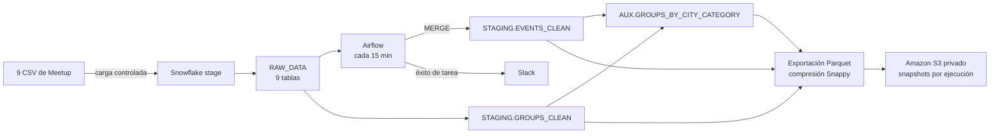

# Meetup Data Engineering Pipeline

Pipeline end-to-end de ingeniería de datos construido para una prueba técnica: ingesta de nueve CSV, transformación analítica, actualización incremental orquestada y exportación por ejecución a Amazon S3. El proyecto prioriza cargas seguras, resultados verificables y una ruta reproducible de ejecución.

**Entrega:** puntos técnicos 1–6 implementados y validados; cambios integrados en `main`.
**Tecnologías:** Snowflake · SQL · Python · Apache Airflow · Docker Compose · Slack · AWS S3 · Parquet/Snappy.

## Resultados frente a la prueba técnica

| Punto | Requisito | Estado | Resultado comprobable |
|---:|---|---|---|
| 1 | Preparar acceso a Snowflake | **FINALIZADO** | Conexión y contexto de ejecución validados. Las credenciales se mantienen fuera del repositorio. |
| 2 | Cargar los nueve CSV a RAW | **FINALIZADO** | Nueve tablas cargadas; conteos comprobados en Snowflake. La carga prepara tablas temporales y solo intercambia RAW al finalizar correctamente. |
| 3 | Crear tablas auxiliares | **FINALIZADO** | `STAGING.GROUPS_CLEAN`, `STAGING.EVENTS_CLEAN` y `AUX.GROUPS_BY_CITY_CATEGORY` creadas y verificadas; sin IDs de evento duplicados en la validación. |
| 4 | Automatizar el flujo cada 15 minutos | **FINALIZADO** | DAG de Airflow con `MERGE` incremental, recreación de la tabla agregada y máximo una ejecución activa. Corrida end-to-end exitosa. |
| 5 | Notificar ejecuciones en Slack | **FINALIZADO** | Notificaciones de éxito entregadas y comprobadas para las tareas del DAG. |
| 6 | Exportar los resultados a S3 | **FINALIZADO** | Tres tablas exportadas a Parquet/Snappy en una corrida manual; objetos verificados en S3 y retención configurada. |

## Arquitectura



El diagrama representa el flujo lógico; Airflow coordina las transformaciones, mientras que Snowflake escribe los archivos al stage de S3 mediante una integración de roles IAM. No se guardan claves AWS en el DAG ni en el repositorio.

## Evidencia de cumplimiento

La siguiente matriz conecta cada requisito con su evidencia y ubicación para facilitar la revisión:

| Punto | Evidencia de validación | Dónde revisar |
|---:|---|---|
| 1 | Prueba de conexión a Snowflake y contexto de rol, base, esquema y warehouse correctos. | Configuración local de Snowflake/Airflow; las credenciales no se publican. |
| 2 | Conteos de las nueve tablas RAW y estrategia de carga con `ON_ERROR = 'ABORT_STATEMENT'`. | [Validación RAW](#validación-de-la-carga-raw) y [sql/03_create_and_load_raw.sql](./sql/03_create_and_load_raw.sql). |
| 3 | Conteos de grupos, eventos y agregación; revisión de IDs y relaciones. | [Resultados analíticos](#resultados-analíticos) y [sql/05_create_auxiliary_tables.sql](./sql/05_create_auxiliary_tables.sql). |
| 4 | Corrida manual con cuatro tareas en `success`; una ejecución confirmó IDs únicos. | [DAG de Airflow](#dag-meetup_incremental_etl) y [dags/meetup_incremental_etl.py](./dags/meetup_incremental_etl.py). |
| 5 | Mensajes de éxito recibidos en el canal configurado. | [Alertas de Slack](#alertas-en-slack). El webhook permanece en la conexión local de Airflow. |
| 6 | Tres archivos Parquet comprobados en S3, uno por tabla, y regla de retención de 30 días. | [Exportación a S3](#exportación-a-amazon-s3-punto-6). Los nombres de bucket y datos de acceso se omiten intencionalmente. |

## Competencias que demuestra el proyecto

- **Ingesta confiable:** manejo de nueve archivos CSV, incluidos archivos de hasta 1.2 GB, con validación de conteos y una estrategia de publicación que evita sustituir RAW con cargas incompletas.
- **Modelado y calidad de datos:** capas RAW/STAGING/AUX, limpieza de tipos, tratamiento de IDs alfanuméricos y comprobaciones de unicidad y relaciones.
- **SQL incremental y orquestación:** `MERGE`, actualización de tabla agregada y coordinación secuencial con Airflow y Docker Compose.
- **Integración cloud con controles de acceso:** exportación directa de Snowflake a S3 mediante roles IAM, bucket privado y permisos acotados; sin claves AWS en el código.
- **Operación y costos:** notificaciones de éxito a Slack, ejecución limitada a una activa, snapshots por corrida y retención automática de 30 días.

### Resultados analíticos

Conteos validados en la carga inicial:

| Esquema | Contenido | Filas validadas en la carga inicial |
|---|---|---:|
| `STAGING.GROUPS_CLEAN` | Grupos tipados y enriquecidos con ciudad/categoría | 16,330 |
| `STAGING.EVENTS_CLEAN` | Eventos tipados (IDs alfanuméricos conservados como texto) | 5,807 |
| `AUX.GROUPS_BY_CITY_CATEGORY` | Métricas de grupos y eventos por ciudad/categoría | 129 |

Los 16,330 grupos y los 5,807 eventos quedaron representados en el resumen; no se encontraron IDs duplicados ni eventos sin grupo asociado. Las métricas de miembros y RSVP son sumas reportadas por grupo/evento, no conteos de personas únicas. El dataset es una fotografía histórica.

## Requisitos

- Python 3.10 o posterior y Snowflake CLI.
- Una conexión Snowflake CLI con acceso a la base de datos, warehouse y esquemas usados.
- Los nueve CSV del [dataset Meetup en Kaggle](https://www.kaggle.com/megelon/meetup), extraídos en `data/`.

`members.csv` pesa aproximadamente 1.2 GB. Los datos, credenciales y logs locales están excluidos de Git. No uses `ACCOUNTADMIN` para la ejecución normal ni subas claves privadas al repositorio.

## Ejecución en Windows

Desde PowerShell, en la raíz del proyecto:

```powershell
py -3 -m venv .venv
.\.venv\Scripts\Activate.ps1
python -m pip install snowflake-cli cryptography
```

Descarga los nueve CSV desde Kaggle y colócalos directamente en `data\`. Configura Snowflake CLI con una conexión llamada `meetup_test_etl_conn` o cambia ese nombre en los comandos:

```powershell
snow connection test -c meetup_test_etl_conn
python -m unittest discover -s tests -v
python scripts/run_sql.py --connection meetup_test_etl_conn --file sql/01_setup_stage.sql
python scripts/upload_dataset.py --connection meetup_test_etl_conn
python scripts/run_sql.py --connection meetup_test_etl_conn --file sql/02_verify_stage.sql
python scripts/run_sql.py --connection meetup_test_etl_conn --file sql/03_create_and_load_raw.sql
python scripts/run_sql.py --connection meetup_test_etl_conn --file sql/05_create_auxiliary_tables.sql
```

El rol necesita permisos de uso en la base de datos y warehouse y permisos para crear los objetos en `RAW_DATA`, `STAGING` y `AUX`. Para una instalación nueva, un administrador debe crear/conceder acceso a la base y permitir `CREATE SCHEMA` al rol ETL. La conexión de validación se configuró localmente; su identificador de cuenta, usuario y clave no forman parte de esta documentación ni del repositorio.

Los scripts `01`–`03` preparan el stage, suben los CSV y cargan las tablas RAW. El script `05` crea las tres tablas analíticas; al repetirse, las reemplaza sin modificar RAW. El script `04_fix_encoding_and_reload.sql` es una reparación específica para cargas anteriores, no parte del flujo normal.

## Validación de la carga RAW

Conteos verificados en Snowflake:

| Tabla | Filas |
|---|---:|
| `CATEGORIES` | 33 |
| `CITIES` | 13 |
| `EVENTS` | 5,807 |
| `GROUPS` | 16,330 |
| `GROUPS_TOPICS` | 31,212 |
| `MEMBERS` | 5,893,886 |
| `MEMBERS_TOPICS` | 3,195,245 |
| `TOPICS` | 2,509 |
| `VENUES` | 107,093 |

El diseño carga primero en tablas `_LOAD` y usa `SWAP` para no reemplazar RAW hasta que la carga nueva finalice. Los CSV con bytes UTF-8 inválidos (`groups_topics.csv`, `members.csv`, `topics.csv`) usan un file format que reemplaza esos caracteres; las cargas conservan `ON_ERROR = 'ABORT_STATEMENT'` para evitar omitir filas silenciosamente.

## Orquestación con Apache Airflow (Puntos 4 y 5)

Airflow se ejecuta localmente con Docker Compose (Airflow 2.10.2, CeleryExecutor, PostgreSQL y Redis). Los proveedores Snowflake y Slack se instalan en los contenedores mediante `_PIP_ADDITIONAL_REQUIREMENTS` en el `.env` local; el archivo `.env` no se versiona.

### DAG: `meetup_incremental_etl`
El DAG definido en [`dags/meetup_incremental_etl.py`](./dags/meetup_incremental_etl.py) usa el cron `*/15 * * * *`, `catchup=False`, permite como máximo una ejecución activa (`max_active_runs=1`) y ejecuta una cadena secuencial de cuatro tareas:

1. **`simulate_new_data`** genera actividad demostrativa en Snowflake: incrementa aleatoriamente RSVP de algunos eventos e inserta un evento sintético asociado a un grupo.
2. **`refresh_staging_events`** transforma `RAW_DATA.EVENTS` y aplica un `MERGE` en `STAGING.EVENTS_CLEAN`: inserta eventos nuevos y actualiza los que tienen un `updated_at` más reciente.
3. **`refresh_aux_table`** vuelve a calcular `AUX.GROUPS_BY_CITY_CATEGORY` usando `CREATE OR REPLACE TABLE` y las tablas de staging.
4. **`export_processed_tables`** exporta las tres tablas procesadas a S3 en formato Parquet con compresión Snappy. Cada ejecución usa un directorio separado por fecha, `run_id` y tabla.

La ejecución se probó en Snowflake con el rol `ETL_ROLE`. La corrida manual `manual__2026-10-09T15:55:19+00:00` terminó en estado `success` para las cuatro tareas, incluida la exportación; también se verificaron los archivos Parquet de las tres tablas en S3. Una ejecución confirmó que los identificadores de `EVENTS_CLEAN` seguían siendo únicos.

> **Importante sobre los datos:** `simulate_new_data` modifica directamente `RAPPI_MEETUP_TEST.RAW_DATA.EVENTS` e inserta una fila sintética nueva en cada ejecución exitosa. Esta simulación sirve para demostrar cambios periódicos, pero hace que RAW deje de ser una copia inmutable del dataset de Kaggle. El DAG puede pausarse desde Airflow si se quiere detener la simulación. No ejecutes la tarea repetidamente en un entorno donde RAW deba permanecer intacto.

### Alertas en Slack
El callback `on_success_callback` usa el proveedor oficial `apache-airflow-providers-slack` y `SlackWebhookOperator`. Está definido en los argumentos por defecto de las tareas, por lo que envía una notificación por cada tarea exitosa (cuatro mensajes por una ejecución completa), con DAG, tarea y fecha de ejecución. La entrega fue comprobada en el canal configurado. El DAG no define actualmente un callback de fallo; los fallos se consultan en Airflow.

### Ejecución de Airflow
Desde la raíz del proyecto, asegúrate de tener Docker Desktop iniciado. Configura el `.env` local con los proveedores requeridos y con la ruta absoluta, en el host, a la clave privada RSA de solo lectura utilizada por el usuario de servicio:

```dotenv
AIRFLOW_UID=<UID del usuario local>
_PIP_ADDITIONAL_REQUIREMENTS=apache-airflow-providers-snowflake apache-airflow-providers-slack
AIRFLOW_SNOWFLAKE_KEY_PATH=<ruta absoluta a rsa_key.p8>
```

En macOS, por ejemplo, `AIRFLOW_SNOWFLAKE_KEY_PATH=/Users/<usuario>/.snowflake/keys/rsa_key.p8`. La clave privada debe corresponder a una clave pública registrada para el usuario de servicio de Snowflake; no la guardes en el repositorio. Compose la monta como solo lectura dentro de los contenedores.

Inicia los servicios:

```bash
docker compose up -d
```

Abre `http://localhost:8080` (usuario y contraseña por defecto `airflow`; solo para desarrollo local). En **Admin → Connections**, configura `snowflake_default` con los datos de cuenta, rol, base, warehouse y usuario de servicio de tu entorno. Configura la clave privada mediante la ruta local montada en el contenedor. No copies credenciales reales en el README, el DAG o capturas públicas.

Configura también `slack_connection` como **Slack Incoming Webhook**. Guarda el webhook únicamente en la conexión local de Airflow; nunca lo incluyas en `.env` versionado, el DAG ni capturas públicas.

Antes de habilitar el DAG, valida la conexión Snowflake con una consulta de solo lectura desde Airflow y confirma el contexto esperado para tu entorno. En la interfaz de Airflow, despausa `meetup_incremental_etl` para permitir las ejecuciones cada 15 minutos; pausa el DAG para detenerlas.

Las tareas originales `simulate_new_data`, `refresh_staging_events` y `refresh_aux_table` se ejecutaron con éxito; los mensajes correspondientes llegaron a Slack. No se incluyen capturas del canal ni de Airflow en este repositorio.

## Exportación a Amazon S3 (Punto 6)

Snowflake exporta las tablas procesadas directamente a Amazon S3 mediante una integración de almacenamiento IAM, sin claves AWS en Airflow ni en el repositorio:

- Bucket privado en AWS `us-east-2` (Ohio), con acceso público bloqueado y cifrado predeterminado.
- La integración de almacenamiento usa un rol IAM con acceso limitado al prefijo de exportación y una relación de confianza configurada según Snowflake.
- Un stage externo Snowflake referencia el prefijo S3 permitido para el rol ETL.
- `COPY INTO` escribe Parquet con compresión Snappy. La prueba de integración creó un archivo de validación en S3 antes de habilitar la exportación de las tablas.

Al terminar `refresh_aux_table`, la tarea `export_processed_tables` exporta `STAGING.GROUPS_CLEAN`, `STAGING.EVENTS_CLEAN` y `AUX.GROUPS_BY_CITY_CATEGORY`. Cada ejecución escribe bajo un directorio único:

```text
s3://<bucket-privado>/<prefijo>/snapshots/<fecha>/<run_id>/<tabla>/
```

La regla de ciclo de vida del bucket expira los objetos actuales bajo `exports/meetup/snapshots/` después de 30 días. No aplica al prefijo `_validation/`. Al ejecutarse el DAG cada 15 minutos, una exportación completa puede producir hasta 96 snapshots al día; el formato Parquet comprimido reduce su tamaño, pero el almacenamiento, las solicitudes S3 y el cómputo Snowflake tienen costo. Supervisa el consumo y pausa el DAG si deseas detener nuevas exportaciones.

La integración se validó primero mediante una exportación Parquet pequeña; después, una corrida manual completa del DAG terminó en `success` y exportó las tres tablas procesadas. Se verificó un archivo Parquet por tabla en S3. No almacenes ni publiques el external ID de Snowflake, identificadores de cuenta, políticas IAM con datos de cuenta, tokens de Slack ni claves privadas.

### Evidencia de validación

La corrida manual completa `manual__2026-10-09T15:55:19+00:00` terminó correctamente en Airflow:

| Tarea | Resultado |
|---|---|
| `simulate_new_data` | `success` |
| `refresh_staging_events` | `success` |
| `refresh_aux_table` | `success` |
| `export_processed_tables` | `success` |

La regla de ciclo de vida retiene los objetos del prefijo `snapshots/` durante 30 días. Las capturas no se incluyen: no se publicaron imágenes verificables en el repositorio. Si se agregan para una entrega, deben sanitizarse para ocultar claves, tokens, external IDs, contraseñas e identificadores de cuenta.

## Estructura

```text
sql/       Scripts de stage, carga RAW, reparación y tablas auxiliares
scripts/   Subida de CSV, ejecución SQL y logging
tests/     Pruebas unitarias locales
data/      CSV descargados (no versionados)
logs/      Logs de ejecución (no versionados)
dags/      DAGs de Apache Airflow para orquestación incremental
```

## Seguridad y alcance de la evidencia

- No hay credenciales, claves privadas, tokens de webhook, external IDs ni valores reales de conexión en el README.
- Las conexiones Snowflake y Slack, la clave RSA y las rutas locales se configuran fuera de Git. La clave se monta en Docker como solo lectura.
- El bucket permanece privado; Snowflake accede mediante una integración de roles IAM y permisos acotados al prefijo requerido.
- Los resultados se describen con evidencia de ejecuciones realizadas. Las capturas no están publicadas, así que la revisión puede reproducir las validaciones con las instrucciones y scripts del repositorio.

## Alcance y decisiones de ingeniería

- La carga RAW usa tablas de preparación y `SWAP`, evitando publicar una carga incompleta; los errores de filas no se ignoran silenciosamente.
- Las transformaciones conservan IDs alfanuméricos y evitan duplicar eventos en la actualización incremental.
- La simulación del DAG modifica la tabla RAW para demostrar cambios periódicos; está identificada como sintética y puede pausarse desde Airflow.
- Las exportaciones separan cada corrida y usan Parquet/Snappy. La retención acota almacenamiento; las ejecuciones frecuentes generan costo en S3 y Snowflake.
