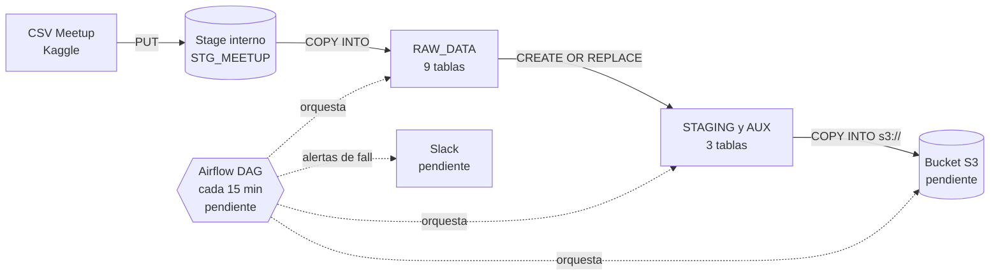

# Meetup Data Pipeline: Snowflake + Airflow + S3

Prueba técnica de Data Engineer. El proyecto carga el dataset **Meetup (Kaggle)** en **Snowflake**, lo transforma en tablas físicas auxiliares, automatiza el proceso con un DAG de **Apache Airflow** cada 15 minutos, notifica fallos por **Slack** y exporta las tablas procesadas a un bucket **S3**.

---

## Tabla de contenido

1. [Estado del proyecto](#estado-del-proyecto)
2. [Arquitectura](#arquitectura)
3. [Stack tecnológico](#stack-tecnológico)
4. [Estructura del repositorio](#estructura-del-repositorio)
5. [Dataset](#dataset)
6. [Requisitos previos](#requisitos-previos)
7. [Preparación desde cero (Windows)](#preparación-desde-cero-windows)
8. [Seguridad y manejo de credenciales](#seguridad-y-manejo-de-credenciales)
9. [Ejecución paso a paso](#ejecución-paso-a-paso)
10. [Decisiones de diseño](#decisiones-de-diseño)
11. [Calidad de datos: hallazgos](#calidad-de-datos-hallazgos)
12. [Validación](#validación)
13. [Problemas encontrados y soluciones](#problemas-encontrados-y-soluciones)
14. [Evidencias](#evidencias)
15. [Próximos pasos](#próximos-pasos)

---

## Estado del proyecto

| # | Requisito | Estado |
|---|-----------|--------|
| 1 | Cuenta/base de datos Snowflake | ✅ Cuenta y conexión a la base de prueba verificadas; confirmar plan Free/Trial en Snowsight |
| 2 | Carga del dataset Meetup en Snowflake | ✅ Nueve CSV en el stage y nueve tablas RAW con conteos esperados |
| 3 | Tablas físicas auxiliares | ✅ Tres tablas creadas y validadas en Snowflake |
| 4 | DAG de Airflow cada 15 min (`MERGE`, `CREATE`, `REPLACE`) | ⏳ Pendiente |
| 5 | Alertas de Airflow hacia Slack | ⏳ Pendiente |
| 6 | Exportación de tablas procesadas a S3 | ⏳ Pendiente |
| 7 | Entrega de código, evidencias y repositorio | 🔄 En curso |

---

## Arquitectura



**Capas en Snowflake** (la base de datos se selecciona en la conexión; `RAPPI_MEETUP_DB` fue el nombre original de desarrollo):

| Esquema | Propósito | Estado |
|---------|-----------|--------|
| `RAW_DATA` | Datos tal cual vienen del CSV, todas las columnas como `VARCHAR` | ✅ |
| `STAGING` | Datos de grupos y eventos limpios y tipados | ✅ `GROUPS_CLEAN` (16,330 filas), `EVENTS_CLEAN` (563 filas) |
| `AUX` | Resumen de grupos, miembros asociados y actividad de eventos por ciudad/categoría | ✅ `GROUPS_BY_CITY_CATEGORY` (129 filas) |

**Validación en `RAPPI_MEETUP_TEST` (7 de octubre de 2026):** `meetup_test_etl_conn` conecta con estado `OK`; los nueve archivos están en `STG_MEETUP`, y las nueve tablas RAW tienen los conteos esperados que se muestran en [Validación](#validación). Esto valida los puntos 1 (cuenta/conexión disponibles) y 2 de la prueba. El plan gratuito/trial se debe confirmar en la página de facturación/uso de Snowsight; el resultado del CLI no informa el tipo de plan.

**Punto 3:** [sql/05_create_auxiliary_tables.sql](./sql/05_create_auxiliary_tables.sql) crea tres tablas analíticas en `STAGING` y `AUX`. Tras conceder a `ETL_ROLE` el permiso `CREATE SCHEMA`, la ejecución terminó correctamente. Se validaron los conteos y la cobertura de grupos/eventos (ver [Punto 3](#punto-3-tablas-físicas-auxiliares)).

---

## Stack tecnológico

| Componente | Uso |
|------------|-----|
| Snowflake (trial, AWS) | Almacenamiento y transformación |
| Snowflake CLI (`snow`) | Ejecución de scripts SQL y conexión |
| Python 3.10 a 3.13 | Scripts auxiliares (CLI, generación de claves) |
| Apache Airflow | Orquestación (pendiente; se recomienda Python 3.11/3.12 o Docker) |
| Slack (webhook o app) | Alertas (pendiente) |
| AWS S3 | Destino de exportación (pendiente) |

---

## Estructura del repositorio

```
.
├── sql/
│   ├── 01_setup_stage.sql              # File format y stage interno
│   ├── 02_verify_stage.sql             # Verifica los CSV subidos
│   ├── 03_create_and_load_raw.sql      # Tablas RAW y COPY INTO
│   └── 04_fix_encoding_and_reload.sql  # Reparación segura de cargas anteriores
├── scripts/
│   ├── upload_dataset.py               # Subida portable de CSV al stage
│   ├── run_sql.py                      # Ejecuta SQL y registra resultados/errores
│   └── runtime_logging.py              # Configuración común de logs
├── gen_keys.py                         # Genera el par de claves RSA (la privada NO se versiona)
├── dags/                               # DAG de Airflow (pendiente)
├── docs/evidence/                      # Capturas y salidas de validación
├── data/                               # CSV originales (ignorado por Git)
├── logs/                               # Logs locales (ignorados por Git)
├── .gitignore
└── README.md
```

---

## Dataset

Dataset **Meetup** de Kaggle: <https://www.kaggle.com/megelon/meetup>.

Los CSV se colocan en la carpeta `data/`, que **no se versiona** (GitHub rechaza archivos de más de 100 MB y `members.csv` pesa 1,2 GB). Cada persona debe descargar el dataset desde Kaggle, crear `data/` si no existe y extraer ahí los nueve CSV; el cargador comprueba que estén todos antes de conectarse.

| Archivo | Tamaño | Filas leídas | Tabla destino |
|---------|--------|--------------|---------------|
| `categories.csv` | < 0,1 MB | 33 | `RAW_DATA.CATEGORIES` |
| `cities.csv` | < 0,1 MB | 13 | `RAW_DATA.CITIES` |
| `events.csv` | 7,5 MB | 5.807 | `RAW_DATA.EVENTS` |
| `groups.csv` | 23,7 MB | 16.330 | `RAW_DATA.GROUPS` |
| `groups_topics.csv` | 1,6 MB | 31.212 | `RAW_DATA.GROUPS_TOPICS` |
| `members.csv` | 1.229,9 MB | 5.893.886 | `RAW_DATA.MEMBERS` |
| `members_topics.csv` | 152,4 MB | 3.195.245 | `RAW_DATA.MEMBERS_TOPICS` |
| `topics.csv` | 0,3 MB | 2.509 | `RAW_DATA.TOPICS` |
| `venues.csv` | 15,4 MB | 107.093 | `RAW_DATA.VENUES` |

---

## Requisitos previos

Para completar esta primera carga necesitas:

1. Una cuenta de Snowflake con una base de datos existente.
2. Un warehouse activo o permiso para usar uno.
3. Python 3.10 o posterior.
4. Snowflake CLI instalado y una conexión que pueda acceder a esa base de datos.
5. Los nueve CSV del dataset Meetup descargados de Kaggle.

**No necesitas crear otra base de datos** si ya tienes una. El pipeline usa la base de datos configurada en la conexión Snowflake y crea los objetos dentro del esquema `RAW_DATA`.

---

## Preparación desde cero (Windows)

Abre PowerShell en la carpeta del proyecto. Si descargaste el repositorio por Git:

```powershell
git clone https://github.com/Andres-Castro-C/prueba_rappy_test.git
Set-Location .\prueba_rappy_test
```

Si ya estás en la carpeta del proyecto, solo ejecuta `Set-Location` con la ruta donde lo guardaste.

### 1. Crear y activar el entorno Python

```powershell
py -3 -m venv .venv
.\.venv\Scripts\Activate.ps1
python -m pip install --upgrade pip
python -m pip install snowflake-cli cryptography
```

Si PowerShell dice que no permite activar scripts, ejecuta una sola vez:

```powershell
Set-ExecutionPolicy -Scope CurrentUser RemoteSigned
```

Confirma que Python y Snowflake CLI están instalados:

```powershell
python --version
snow --version
```

### 2. Descargar y colocar los archivos de datos

1. Descarga el dataset desde <https://www.kaggle.com/megelon/meetup>.
2. Extrae el ZIP.
3. En la carpeta del proyecto, crea `data` si no existe: `New-Item -ItemType Directory -Force data`.
4. Copia los nueve CSV directamente a `data` (no dejes los CSV dentro de otra subcarpeta).

Verifica que estén los nueve:

```powershell
Get-ChildItem .\data\*.csv | Select-Object Name, Length
```

Deben aparecer `categories.csv`, `cities.csv`, `events.csv`, `groups.csv`, `groups_topics.csv`, `members.csv`, `members_topics.csv`, `topics.csv` y `venues.csv`. `members.csv` es grande; la subida puede tardar.

### 3. Configurar la conexión de Snowflake

No reemplaces la conexión que apunta a tu base de datos actual. Usa una conexión aparte llamada `meetup_test_conn`, que apunte a la base de prueba `RAPPI_MEETUP_TEST`. Así podrás probar el flujo sin cambiar la conexión original.

Primero revisa las conexiones existentes:

```powershell
snow connection list
```

Si `meetup_test_conn` ya aparece, **no vuelvas a crearla**. Comprueba que el listado muestre `database: RAPPI_MEETUP_TEST`, `schema: RAW_DATA`, `authenticator: externalbrowser`, el warehouse esperado y el rol autorizado. Si los valores son correctos, continúa con `snow connection test -c meetup_test_conn`.

Solo si `meetup_test_conn` no aparece, créala con este comando. Reemplaza los valores entre `< >` por los de tu cuenta:

```powershell
snow connection add --connection-name meetup_test_conn `
  --account <IDENTIFICADOR_DE_CUENTA> `
  --user <USUARIO_SNOWFLAKE> `
  --authenticator externalbrowser `
  --role <ROL_CON_PERMISOS> `
  --warehouse <WAREHOUSE> `
  --database RAPPI_MEETUP_TEST `
  --schema RAW_DATA `
  --no-interactive
```

Usa estos valores:

- `<IDENTIFICADOR_DE_CUENTA>` y `<USUARIO_SNOWFLAKE>`: los valores de tu conexión actual.
- `<ROL_CON_PERMISOS>`: un rol que pueda usar el warehouse y crear tablas, stages y formatos en `RAPPI_MEETUP_TEST.RAW_DATA`.
- `<WAREHOUSE>`: el warehouse de tu conexión actual.

En el caso de una conexión de usuario con inicio de sesión por navegador, `--authenticator externalbrowser` es el parámetro correcto. **No escribas `--host externalbrowser`**: eso guarda `externalbrowser` como host, no como autenticador. No pegues el bloque TOML `[connections...]` en PowerShell; el comando de arriba crea la entrada correctamente.

Después comprueba que la conexión nueva aparece y que realmente apunta a la base de prueba:

```powershell
snow connection list
snow connection test -c meetup_test_conn
```

El navegador puede abrirse para iniciar sesión. En el listado, comprueba que `meetup_test_conn` tiene `authenticator: externalbrowser`, `database: RAPPI_MEETUP_TEST` y el warehouse esperado. El aviso `Encoding mismatch detected` no significa por sí mismo que la conexión haya fallado; el resultado de `snow connection test` es el que se debe comprobar.

Si la conexión existe, pero apunta a otra base o tiene parámetros equivocados, elimina **solo** la conexión de prueba y vuelve a crearla. Este comando no borra ninguna base, tabla ni dato de Snowflake:

```powershell
snow connection remove meetup_test_conn
```

Confirma la eliminación si CLI lo pregunta, ejecuta el comando `snow connection add` de arriba y vuelve a probarla. No elimines `meetup_conn`, `etl_conn` ni `my_example_connection`.

Si `snow connection test` muestra `390190 ... SAML Identity Provider`, el proveedor de identidad rechazó el inicio de sesión por navegador. No repitas `snow connection add`: la conexión ya está guardada y el error no se arregla cambiando el nombre. Usa otro método de autenticación permitido por tu cuenta. En este proyecto ya existe `etl_conn`, configurada con el usuario de servicio `SVC_ETL`, autenticación por clave y rol `ETL_ROLE`; puedes usar esa identidad para la prueba aislada, después de concederle acceso a la base de prueba como se explica abajo.

Si el administrador ya registró en `SVC_ETL` la clave pública correspondiente a `~/.snowflake/keys/rsa_key.p8`, crea una conexión separada para la base de prueba:

```powershell
snow connection add --connection-name meetup_test_etl_conn `
  --account <IDENTIFICADOR_DE_CUENTA> `
  --user SVC_ETL `
  --authenticator SNOWFLAKE_JWT `
  --private-key-file "$HOME\.snowflake\keys\rsa_key.p8" `
  --role ETL_ROLE `
  --warehouse SNOWFLAKE_LEARNING_WH `
  --database RAPPI_MEETUP_TEST `
  --schema RAW_DATA `
  --no-interactive
```

Si esa conexión ya existe, no intentes añadirla otra vez: revisa sus valores con `snow connection list`. Sustituye `<IDENTIFICADOR_DE_CUENTA>` y la ruta a la clave por los valores propios. La conexión local `etl_conn` solo está disponible si ya fue configurada en tu computadora; una persona que clone el repositorio debe pedir al administrador una identidad de servicio con autenticación por clave. Nunca compartas ni subas al repositorio el archivo de clave privada.

### 4. Crear la base de prueba, el esquema y permisos

El error `Could not use database "RAPPI_MEETUP_TEST". Object does not exist, or operation cannot be performed` significa que la base no existe con ese nombre o que el rol no tiene acceso. En Snowsight, abre una worksheet con un rol administrador autorizado y ejecuta:

```sql
CREATE DATABASE IF NOT EXISTS RAPPI_MEETUP_TEST;
CREATE SCHEMA IF NOT EXISTS RAPPI_MEETUP_TEST.RAW_DATA;
```

Luego concede al rol `ETL_ROLE` los permisos necesarios. Si el warehouse tiene otro nombre, reemplaza `SNOWFLAKE_LEARNING_WH` por el suyo:

```sql
GRANT USAGE ON DATABASE RAPPI_MEETUP_TEST TO ROLE ETL_ROLE;
GRANT USAGE ON WAREHOUSE SNOWFLAKE_LEARNING_WH TO ROLE ETL_ROLE;
GRANT USAGE ON SCHEMA RAPPI_MEETUP_TEST.RAW_DATA TO ROLE ETL_ROLE;
GRANT USAGE, CREATE TABLE, CREATE STAGE, CREATE FILE FORMAT
  ON SCHEMA RAPPI_MEETUP_TEST.RAW_DATA TO ROLE ETL_ROLE;
```

`CREATE DATABASE` requiere permiso administrativo; si no puedes ejecutarlo, pide a quien administre Snowflake que cree la base de prueba y aplique los `GRANT`. No ejecutes la carga en `RAPPI_MEETUP_DB` como alternativa.

Después comprueba la conexión de nuevo:

```powershell
snow connection test -c meetup_test_etl_conn
```

La validación de esta prueba terminó con `Status: OK` y estos valores:

| Campo | Valor |
|-------|-------|
| Connection name | `meetup_test_etl_conn` |
| Account | Cuenta Snowflake del usuario (identificador omitido) |
| User | `SVC_ETL` |
| Role | `ETL_ROLE` |
| Database | `RAPPI_MEETUP_TEST` |
| Warehouse | `SNOWFLAKE_LEARNING_WH` |

Esto confirma que Snowflake CLI puede autenticarse con key-pair y usar la base de prueba. No demuestra todavía que los archivos se hayan subido ni que las tablas RAW se hayan cargado; esos son los siguientes pasos. No uses `etl_conn` directamente para la carga: actualmente esa conexión apunta a `RAPPI_MEETUP_DB`, no a la base de prueba.

El aviso `Encoding mismatch detected` puede aparecer antes del resultado. Si la tabla de conexión muestra `Status: OK`, ese aviso no impidió la conexión.

---

## Ejecución paso a paso

Ejecuta cada comando desde la carpeta principal del proyecto y **espera a que termine antes de ejecutar el siguiente**. Después del error SAML, usa la conexión por clave `meetup_test_etl_conn` que acabas de crear. Si el inicio de sesión de navegador sí funciona en tu cuenta, también puedes usar `meetup_test_conn`. Si algo falla, revisa `logs/pipeline.log`, corrige el problema y vuelve a intentar ese mismo paso.

Antes de conectarte a Snowflake, comprueba el código localmente:

```powershell
python -m unittest discover -s tests -v
```

El resultado debe terminar en `OK`. Si muestra `FAILED`, no continúes con la carga hasta revisar el error.

### Paso 1: preparar el área de carga en Snowflake

```powershell
python scripts/run_sql.py --connection meetup_test_etl_conn --file sql/01_setup_stage.sql
```

Debe terminar con el mensaje `completed successfully`. Esto crea el formato CSV y el stage dentro de `RAW_DATA`. Se puede volver a ejecutar.

### Paso 2: subir los nueve CSV

```powershell
python scripts/upload_dataset.py --connection meetup_test_etl_conn
```

Primero prueba la conexión y, si no funciona, se detiene sin intentar las cargas. Si la conexión funciona, debe reportar `Uploaded all 9 files successfully`. Si algún CSV falta, o Snowflake rechaza una subida, el programa intenta los demás archivos, guarda el error y devuelve un resultado de fallo al final. Corrige lo que indique el log antes de seguir.

### Paso 3: comprobar que los archivos llegaron

```powershell
python scripts/run_sql.py --connection meetup_test_etl_conn --file sql/02_verify_stage.sql
```

Comprueba que el resultado de `LIST` muestre los nueve nombres de archivo.

### Paso 4: cargar las nueve tablas RAW

```powershell
python scripts/run_sql.py --connection meetup_test_etl_conn --file sql/03_create_and_load_raw.sql
```

Las tablas `_LOAD` son auxiliares **temporales del proceso de carga**, no las tablas del requisito 3. Se usan para preparar los CSV sin borrar primero las tablas RAW existentes. Después de que las nuevas cargas se intercambian correctamente, el script elimina las `_LOAD`; al final deben quedar las nueve tablas RAW, sin las nueve `_LOAD`.

Verifica que el resultado final muestre conteos similares a los de la sección [Validación](#validación) y que el esquema contenga las nueve tablas RAW.

### Paso 5: revisar resultados y log

Abre Snowsight y confirma que las tablas están en `TU_BASE_DE_DATOS.RAW_DATA`. Para leer el log desde PowerShell:

```powershell
Get-Content .\logs\pipeline.log -Tail 100
```

La carga nueva **no necesita** `sql/04_fix_encoding_and_reload.sql`: es solo una reparación de tablas antiguas.

### ¿Esto completa los puntos de la prueba?

- **Punto 1:** la cuenta y la conexión a `RAPPI_MEETUP_TEST` están verificadas. Confirma en Snowsight que la cuenta sigue en modalidad gratuita/trial, ya que Snowflake CLI no muestra la modalidad del plan.
- **Punto 2:** validado: los nueve CSV están en el stage y las nueve tablas RAW tienen los conteos esperados; la carga terminó exitosamente el 7 de octubre de 2026.
- **Punto 3:** validado en Snowflake: 16,330 grupos limpios, 563 eventos limpios y 129 filas agregadas; todos los grupos están en el resumen y todos los eventos corresponden a un grupo.

---

## Punto 3: tablas físicas auxiliares

No necesitamos crear una copia física de cada CSV. El alcance inicial se limita a tres tablas que convierten los campos utilizados para el análisis y preparan un resumen concreto:

| Tabla | Para qué sirve |
|-------|----------------|
| `STAGING.GROUPS_CLEAN` | Una fila por grupo, con IDs, miembros, rating, fecha y coordenadas convertidos a tipos numéricos/fecha. Enriquece ciudad y categoría con sus tablas RAW. |
| `STAGING.EVENTS_CLEAN` | Una fila por evento, con IDs, fechas, RSVP y rating convertidos para agregarlos sin repetir conversiones. |
| `AUX.GROUPS_BY_CITY_CATEGORY` | Resume por ciudad y categoría cantidad de grupos, suma de miembros declarados, rating promedio y actividad de eventos/RSVP. |

Con estas tres tablas se pueden responder preguntas como “¿qué ciudades/categorías tienen más grupos?”, “¿cuántos miembros declaran esos grupos?” y “¿dónde se concentran los eventos y sus RSVP?”. Los dos pasos `STAGING` limpian y tipan los datos una sola vez; `AUX` entrega el resumen listo para consultar o exportar.

**Cómo interpretar las métricas:** `members_across_groups` suma los miembros declarados por cada grupo; no representa personas únicas, ya que una persona podría pertenecer a varios grupos. `yes_rsvp_across_events` suma RSVP de eventos y tampoco es un conteo de personas únicas. Los resultados describen el snapshot histórico del dataset, no actividad en tiempo real.

### Permisos para las tablas auxiliares

El SQL necesita crear los esquemas `STAGING` y `AUX`. En la base de prueba, el primer intento se detuvo al no tener `ETL_ROLE` el permiso `CREATE SCHEMA`; un administrador lo concedió y después la creación de las tres tablas terminó correctamente. Para ejecutar el flujo en otra base/rol, un administrador debe conceder el permiso una sola vez:

```sql
GRANT CREATE SCHEMA ON DATABASE RAPPI_MEETUP_TEST TO ROLE ETL_ROLE;
```

Si el nombre de la base o rol es distinto, sustituirlo por los valores correctos. El rol también debe tener `USAGE` en la base y `USAGE` en `SNOWFLAKE_LEARNING_WH`. Luego verifica la conexión y ejecuta el SQL:

```powershell
python scripts/run_sql.py --connection meetup_test_etl_conn --file sql/05_create_auxiliary_tables.sql
```

El SQL usa `CREATE OR REPLACE TABLE ... AS SELECT`, por lo que una repetición reemplaza estas tres tablas derivadas; no modifica las nueve tablas RAW. La ejecución validada creó `STAGING.GROUPS_CLEAN` (16,330 filas), `STAGING.EVENTS_CLEAN` (563) y `AUX.GROUPS_BY_CITY_CATEGORY` (129). Se verificó además que los 16,330 grupos están cubiertos por el resumen, que sus IDs son distintos, y que los 563 eventos aparecen en el resumen y tienen un grupo asociado.

---

## Seguridad y manejo de credenciales

- **Ninguna credencial se versiona.** `.gitignore` excluye `.venv/`, `data/`, `logs/`, `*.csv`, `*.p8`, `.env` y `__pycache__/`.
- **Autenticación:** la conexión Snowflake CLI se configura localmente; este repositorio no contiene credenciales.
- **Permisos mínimos:** el rol de la conexión necesita acceso a tu base de datos existente, uso del warehouse y permisos para trabajar en `RAW_DATA`. No ejecutes las cargas como `ACCOUNTADMIN`.
- La clave privada vive fuera del repositorio. En Airflow se inyectará como secreto (Connection o variable de entorno), nunca dentro del código del DAG.
- El warehouse tiene `AUTO_SUSPEND` corto para no consumir créditos del trial sin necesidad.

---

## Decisiones de diseño

| Decisión | Motivo |
|----------|--------|
| Carga por código (`PUT` + `COPY INTO`) en lugar de la interfaz web | La interfaz web limita los archivos a 250 MB, y `members.csv` pesa 1,2 GB |
| No dividir los archivos en bloques | `PUT` sube en paralelo y comprime: `members.csv` quedó en unos 165 MB comprimidos |
| Capa RAW con todas las columnas como `VARCHAR` | Evita errores de carga por fechas o números mal formados; los tipos se aplican en staging |
| Subida local con Snowflake CLI desde Python | Evita rutas absolutas específicas de un equipo y funciona en los principales sistemas operativos |
| Tablas `_LOAD` y `SWAP` | Mantiene la versión actual de las tablas RAW mientras se cargan los CSV |
| `ABORT_STATEMENT` para las cargas | Evita que el proceso reporte éxito dejando filas fuera silenciosamente |
| Logs locales rotativos | Conserva diagnósticos sin versionar salidas potencialmente sensibles |
| File format independiente para caracteres inválidos | Limita la sustitución de caracteres a `GROUPS_TOPICS`, `MEMBERS` y `TOPICS` sin cambiar las otras cargas |
| Autenticación configurada fuera del repositorio | Evita almacenar secretos en el código |
| Rol con permisos limitados | El pipeline no requiere ejecutar las cargas como `ACCOUNTADMIN` |
| `ON_ERROR = 'ABORT_STATEMENT'` en las cargas | Evita que se salten filas en silencio |

---

## Calidad de datos: hallazgos

### Caracteres no UTF-8 en algunos CSV

Algunos archivos contienen bytes que no son UTF-8 válido. En la ejecución, Snowflake detectó este caso en `groups_topics.csv`:

| Tabla | Filas rechazadas | Ejemplo | Columna |
|-------|------------------|---------|---------|
| `GROUPS_TOPICS` | La carga estricta se detuvo | `Health and Wellness 0x95 Wellness 0x95 Holistic Health` | `topic_name` |

La carga se detuvo intencionalmente porque `ON_ERROR = 'ABORT_STATEMENT'` evita omitir registros silenciosamente. Un byte `0x95` no es válido como carácter UTF-8 independiente. El barrido local de los CSV encontró secuencias UTF-8 inválidas en `groups_topics.csv`, `members.csv` y `topics.csv`; los otros seis archivos pasaron esa comprobación.

**Solución aplicada:** el flujo normal usa `FF_CSV_REPLACE_INVALID` con `REPLACE_INVALID_CHARACTERS = TRUE` para `GROUPS_TOPICS`, `MEMBERS` y `TOPICS`, manteniendo `ABORT_STATEMENT`. Snowflake reemplaza los bytes inválidos en vez de rechazar el archivo completo; las demás tablas siguen usando el formato estricto normal. No se interpreta todo el CSV como Latin-1, lo que podría dañar los caracteres UTF-8 válidos.

Vuelve a ejecutar el paso 4 después de que la versión actualizada de `sql/03_create_and_load_raw.sql` esté disponible. Este archivo recrea las tablas de trabajo `_LOAD`, de modo que la carga fallida anterior puede reintentarse sin truncar primero las tablas RAW.

### Otras observaciones

- `members.csv` contiene una fila por membresía a un grupo: el mismo `member_id` aparece varias veces con distinto `group_id`. La **llave natural** para los `MERGE` es `member_id + group_id`.
- En `members_topics.csv`, las columnas `topic_key` y `topic_name` traen los valores intercambiados (el encabezado dice `topic_key` pero el valor es un nombre, y viceversa). Se cargan tal cual en RAW y se corrigen en staging.

---

## Validación

En Snowsight, selecciona la misma base de datos configurada en la conexión y ejecuta este conteo:

```sql
SELECT 'CATEGORIES' AS table_name, COUNT(*) AS row_count FROM RAW_DATA.CATEGORIES
UNION ALL SELECT 'CITIES', COUNT(*) FROM RAW_DATA.CITIES
UNION ALL SELECT 'EVENTS', COUNT(*) FROM RAW_DATA.EVENTS
UNION ALL SELECT 'GROUPS', COUNT(*) FROM RAW_DATA.GROUPS
UNION ALL SELECT 'GROUPS_TOPICS', COUNT(*) FROM RAW_DATA.GROUPS_TOPICS
UNION ALL SELECT 'MEMBERS', COUNT(*) FROM RAW_DATA.MEMBERS
UNION ALL SELECT 'MEMBERS_TOPICS', COUNT(*) FROM RAW_DATA.MEMBERS_TOPICS
UNION ALL SELECT 'TOPICS', COUNT(*) FROM RAW_DATA.TOPICS
UNION ALL SELECT 'VENUES', COUNT(*) FROM RAW_DATA.VENUES;
```

Valores esperados tras la recarga:

| Tabla | Filas esperadas |
|-------|-----------------|
| `CATEGORIES` | 33 |
| `CITIES` | 13 |
| `EVENTS` | 5.807 |
| `GROUPS` | 16.330 |
| `GROUPS_TOPICS` | 31.212 |
| `MEMBERS` | 5.893.886 |
| `MEMBERS_TOPICS` | 3.195.245 |
| `TOPICS` | 2.509 |
| `VENUES` | 107.093 |

### Historial de carga (filas leídas vs. cargadas vs. errores)

```sql
SELECT table_name, row_parsed, row_count, error_count
FROM INFORMATION_SCHEMA.LOAD_HISTORY
WHERE schema_name = 'RAW_DATA'
ORDER BY table_name, last_load_time DESC;
```

`row_parsed` debe coincidir con `row_count` y `error_count` debe ser 0 en todas las tablas.

> Nota: el conteo por líneas de un CSV puede dar más que el de Snowflake cuando hay textos con saltos de línea (por ejemplo, el campo `bio` de `members`).

---

## Problemas encontrados y soluciones

| Síntoma | Causa | Solución |
|---------|-------|----------|
| `snow: command not found` | Python de la Microsoft Store guarda los scripts fuera del `PATH` | Usar un entorno virtual (`.venv`) |
| `Failed to set strict permissions on ...config.toml` | Windows redirige `AppData\Local` para Python de la Store | Definir `SNOWFLAKE_HOME` en una carpeta propia |
| `Password is empty` | El asistente `snow connection add` dejó `externalbrowser` en el campo `host` | Recrear la conexión con flags explícitos y `--no-interactive` |
| `390190 ... SAML Identity Provider` | El proveedor de identidad rechazó el inicio de sesión por navegador | Usa una conexión `SNOWFLAKE_JWT` de servicio si está configurada y autorizada para la base de prueba; de lo contrario, consulta al administrador |
| `Could not use database "RAPPI_MEETUP_TEST"` | La base no existe o el rol de la conexión no tiene permiso de uso | Crear/verificar la base y el esquema; conceder `USAGE` al rol y volver a probar la conexión |
| `ETL_ROLE must have CREATE SCHEMA granted on DATABASE RAPPI_MEETUP_TEST` | El rol no puede crear los esquemas `STAGING` y `AUX` | Un administrador ejecuta `GRANT CREATE SCHEMA ON DATABASE RAPPI_MEETUP_TEST TO ROLE ETL_ROLE` |
| `Encoding mismatch detected` seguido de `Status: OK` | El CLI detectó que la codificación de la terminal y la configuración difieren | No bloqueó la conexión; confirma el resultado en la fila `Status` |
| `No active warehouse selected in the current session` | Snowsight no tiene warehouse activo | Seleccionar el warehouse arriba a la derecha o `USE WAREHOUSE ...` |
| `Failed to transfer ownership ... APPLYBUDGET` | Se intentó cambiar el dueño de la tabla | No es necesario: `ACCOUNTADMIN` hereda los privilegios por la jerarquía de roles |
| `Invalid UTF8 detected` | Filas en Latin-1 dentro de un CSV en UTF-8 | Ver [hallazgos de calidad](#calidad-de-datos-hallazgos) |
| Salida ilegible de `SHOW ...` en la terminal | Tabla demasiado ancha para la consola | Consultar `INFORMATION_SCHEMA` con pocas columnas, o usar `--format json` |

---

## Evidencias

Guardar en `docs/evidence/` y enlazar aquí:

- [ ] Captura de la cuenta de Snowflake creada.
- [x] Conexión de prueba `meetup_test_etl_conn` validada (`Status: OK`; database `RAPPI_MEETUP_TEST`).
- [x] Salida del `LIST @RAW_DATA.STG_MEETUP` con los 9 archivos.
- [x] Conteo de filas de las 9 tablas coincidente con los valores esperados.
- [ ] Resultado de `LOAD_HISTORY` con `error_count = 0`.
- [ ] Ejecución exitosa del DAG en la interfaz de Airflow.
- [ ] Alerta recibida en Slack.
- [ ] Archivos exportados en el bucket S3.

---

## Próximos pasos

1. **Punto 3 completado:** tablas auxiliares ejecutadas y validadas en `RAPPI_MEETUP_TEST`.
2. **DAG de Airflow:** schedule `*/15 * * * *`, conexión a Snowflake por key-pair, tareas idempotentes y reintentos.
3. **Alertas a Slack:** `on_failure_callback` con webhook o app de Slack; el secreto se guarda como Connection de Airflow.
4. **Exportación a S3:** `COPY INTO 's3://...'` desde Snowflake mediante una *storage integration* (sin claves de AWS en texto plano).
5. **Cierre:** completar las evidencias, revisar el `.gitignore` y publicar el repositorio.

---

## Autor

`<Nombre>` · `<correo o perfil de contacto>`
